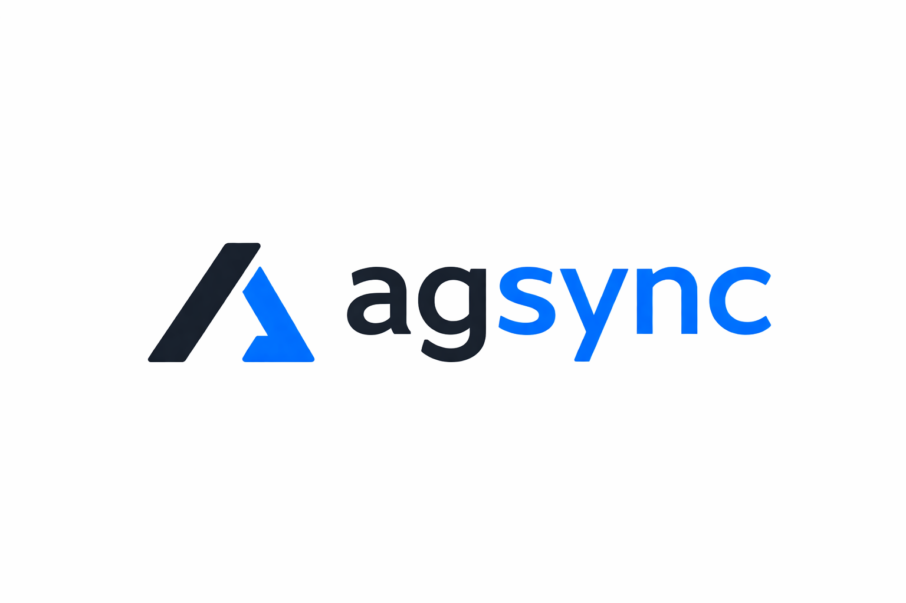

<p align="center">
  
</p>

<p align="center">
  Git-native CLI to sync skills and MCP tools across Claude Code, Codex, Cursor, and Windsurf.
</p>

<p align="center">
  <a href="https://github.com/yiftahb/agsync/actions/workflows/ci.yml"></a>
  <a href="https://www.npmjs.com/package/agsync-cli"></a>
  <a href="https://github.com/yiftahb/agsync/blob/main/LICENSE"></a>
</p>

Define your AI agent skills and tool configurations once in `.agsync/`, then generate client-specific output for every coding agent your team uses.

## Supported Agents

| Agent | Status |
|-------|--------|
| Claude Code | ✅ |
| Cursor | ✅ |
| Codex | ✅ |
| OpenCode | Coming Soon |
| Windsurf | ✅ |
| Cline | Coming Soon |
| Aider | Coming Soon |
| GitHub Copilot | Coming Soon |

## Install

```bash
npm i -g agsync-cli
```

Or run directly:

```bash
npx agsync-cli
```

## Quick Start

```bash
# Scaffold a new project
agsync init

# Import a skill from GitHub
agsync skill add Shubhamsaboo/awesome-llm-apps code-reviewer

# Validate definitions
agsync validate

# Generate client configs
agsync sync
```

After `agsync sync`, your repo will contain:

```
project/
├── agsync.yaml                          # Your config
├── .agsync/skills/*/                    # Source of truth
├── .agsync/tools/*.yaml                 # MCP tool definitions
│
├── AGENTS.md                            # Skill listing injected (agsync section)
├── CLAUDE.md                            # Skill listing injected (agsync section)
├── .agents/skills/*/SKILL.md            # Canonical skill output
├── .claude/skills/                      # Symlink to .agents/skills/ (Claude Code)
├── .claude/settings.json                # Generated MCP config (Claude Code)
├── .cursor/mcp.json                     # Generated MCP config (Cursor)
├── .windsurf/skills/                    # Symlink to .agents/skills/ (Windsurf)
└── .windsurf/mcp_config.json            # Generated MCP config (Windsurf)
```

## How It Works

agsync reads canonical skill and tool definitions from `.agsync/`, resolves inheritance chains, and generates the native format each client expects:

- **Skills** are generated as `SKILL.md` files in `.agents/skills/` (canonical output). Client-specific directories (`.claude/skills/`, `.windsurf/skills/`) are symlinks to `.agents/skills/`
- **AGENTS.md and CLAUDE.md** both receive the same `<!-- agsync:begin -->` / `<!-- agsync:end -->` section with a skill listing. Manual content outside the markers is preserved. CLAUDE.md is only generated when `claude-code` is a target
- **MCP configs** are merged into `.claude/settings.json`, `.cursor/mcp.json`, and `.windsurf/mcp_config.json` (existing entries preserved, not overwritten)

## Commands

### `agsync init`

Creates `agsync.yaml` and the `.agsync/` directory structure with a sample skill.

### `agsync skill add <org/repo> <skill-name>`

Registers a skill from a GitHub repository. Creates a lightweight YAML stub with the skill's name, description, and source reference. The actual content (instructions, scripts, references) is fetched during `agsync sync`.

```bash
# Import from any repo that has skills
agsync skill add Shubhamsaboo/awesome-llm-apps code-reviewer
agsync skill add your-org/your-repo your-skill

# Import skills bundled with agsync
agsync skill add yiftahb/agsync agent-skills
agsync skill add yiftahb/agsync claude-skills
```

### `agsync skill remove <skill-name>`

Removes a skill from `.agsync/skills/`.

```bash
agsync skill remove code-reviewer
```

### `agsync validate`

Validates all config and definitions: schema checks, duplicate names, cross-references between skills and tools. Warns when tool env values reference environment variables that are not currently set.

```
Warnings:
  tool: github: Env var "GITHUB_PERSONAL_ACCESS_TOKEN" is not set (key "GITHUB_PERSONAL_ACCESS_TOKEN")
```

Warnings do not cause a non-zero exit code. Only hard errors do.

### `agsync plan`

Preview what `sync` would do without writing any files. Shows files to create, update, and delete.

```
$ agsync plan
Create:
  + .agents/skills/helper/SKILL.md
  + .claude/skills/helper/SKILL.md
Update:
  ~ AGENTS.md
  ~ .claude/settings.json

4 file(s): 2 create, 2 update, 0 delete
```

### `agsync sync`

The core command. Runs `plan` internally then applies all changes: resolves skill extends chains, expands environment variable references in tool definitions, cleans output directories, then generates all client configs.

### `agsync doctor`

Checks environment health: Node.js version, config presence, hierarchy chain, and installed client CLIs.

```
[PASS] Node.js version: v22.13.1
[PASS] agsync.yaml: Found
[PASS] Config hierarchy: Single config (no parent)
[PASS] claude-code CLI: Installed
[PASS] codex CLI: Installed
[WARN] cursor CLI: Not found in PATH
```

## Skill Examples

Each skill is a directory under `.agsync/skills/` with a YAML file matching the directory name.

### Simple skill

A minimal skill with just name, description, and instructions:

```yaml
# .agsync/skills/testing-standards/testing-standards.yaml
name: testing-standards
description: >
  Enforces testing standards. Use when writing or reviewing tests.
instructions: |
  Always write tests using the project's test framework.
  Ensure >80% coverage on new code.
  Use descriptive test names that explain the expected behavior.
```

### Skill with scripts and references

Skills can include executable scripts, reference documentation, and assets:

```
.agsync/skills/db-migrations/
├── db-migrations.yaml
├── scripts/
│   └── check-migration.sh     # Agents can execute this
├── references/
│   └── schema-guide.md        # Loaded on demand for context
└── assets/
    └── migration-template.sql  # Templates and data files
```

```yaml
# .agsync/skills/db-migrations/db-migrations.yaml
name: db-migrations
description: >
  Database migration expert. Use when creating, reviewing, or
  troubleshooting database migrations.
instructions: |
  You are an expert in database migrations.

  Before creating a migration, run scripts/check-migration.sh to
  validate the current schema state. Refer to references/schema-guide.md
  for naming conventions and best practices.
```

### Importing a skill from open source

Import skills from any GitHub repo that follows the [Agent Skills](https://agentskills.io) standard:

```bash
agsync skill add Shubhamsaboo/awesome-llm-apps code-reviewer
```

This creates a lightweight stub that points to the source. During `agsync sync`, the remote SKILL.md and supporting files (scripts, references, assets) are fetched automatically:

```yaml
# .agsync/skills/code-reviewer/code-reviewer.yaml (created by skill add)
name: code-reviewer
description: >
  Reviews code for quality, security, and performance.
source:
  registry: github
  org: Shubhamsaboo
  repo: awesome-llm-apps
  path: awesome_agent_skills/code-reviewer
```

### Extending an imported skill

Add `instructions` to a sourced skill to extend it. Your instructions are appended after the remote skill's instructions:

```yaml
# .agsync/skills/code-reviewer/code-reviewer.yaml
name: code-reviewer
description: >
  Security-focused code reviewer for our team.
source:
  registry: github
  org: Shubhamsaboo
  repo: awesome-llm-apps
  path: awesome_agent_skills/code-reviewer
instructions: |
  Additionally, focus on OWASP Top 10 vulnerabilities.
  Flag any hardcoded secrets or credentials.
tools:
  - github
```

### Skill inheritance with extends

Skills can also inherit from local or remote skills via `extends`. Base instructions are concatenated, tools are union-merged, and the extending skill's name and description take precedence.

```yaml
# .agsync/skills/security-reviewer/security-reviewer.yaml
name: security-reviewer
description: >
  Security-focused code reviewer. Use for security audits.
extends:
  - ./code-reviewer                        # Local skill in .agsync/skills/
  - github:your-org/shared-skills/owasp    # Fetched from GitHub, cached locally
instructions: |
  Focus specifically on OWASP Top 10 vulnerabilities.
```

## MCP Tool Definitions

Define MCP servers in `.agsync/tools/*.yaml`. Here's a real example using the GitHub MCP server:

```yaml
# .agsync/tools/github.yaml
name: github
description: GitHub MCP server for interacting with GitHub APIs — repos, issues, PRs, files, and more
type: mcp
command: npx
args: ["-y", "@modelcontextprotocol/server-github"]
env:
  GITHUB_PERSONAL_ACCESS_TOKEN: $GITHUB_PERSONAL_ACCESS_TOKEN
```

`agsync sync` generates `.claude/settings.json`, `.cursor/mcp.json`, and `.windsurf/mcp_config.json` from these definitions. Existing entries in those files are preserved (merge, not overwrite).

### Environment Variable Expansion

Env values support `$VAR` and `${VAR}` syntax. During `agsync sync`, these are expanded from the current shell environment. This keeps secrets out of version control — define the reference in your tool YAML and set the actual value in your shell:

```bash
export GITHUB_PERSONAL_ACCESS_TOKEN=ghp_xxxxx
agsync sync
```

If a referenced variable is not set, sync will fail with a clear error. `agsync validate` will warn about unset variables without failing.

Add generated config files (`.claude/settings.json`, `.cursor/mcp.json`, `.windsurf/mcp_config.json`) to `.gitignore` when using env expansion to avoid committing resolved secrets.

## Monorepo Support

Place `agsync.yaml` at multiple levels. When `agsync sync` runs, it walks up the directory tree to the git root, collecting and merging all configs:

```
monorepo/
├── agsync.yaml              # Org-wide skills and tools
├── .agsync/skills/
├── apps/
│   └── api/
│       ├── agsync.yaml      # API-specific skills
│       └── .agsync/skills/
└── packages/
    └── shared/
        └── agsync.yaml      # Package-specific skills
```

## Bundled Skills

agsync ships with skills for understanding each client's skill and tool systems:

| Skill | Description |
|-------|-------------|
| `agsync` | Expert in agsync itself |
| `agent-skills` | The open Agent Skills standard (agentskills.io) |
| `claude-skills` | Claude Code Agent Skills |
| `cursor-skills` | Cursor Agent Skills |
| `codex-skills` | Codex Agent Skills |
| `claude-tools` | Claude Code MCP configuration |
| `cursor-tools` | Cursor MCP configuration |
| `codex-tools` | Codex tool dependencies |
| `windsurf-skills` | Windsurf Agent Skills |
| `windsurf-tools` | Windsurf MCP configuration |

Import any of them:

```bash
agsync skill add yiftahb/agsync claude-skills
```

## Configuration

`agsync.yaml` at the project root:

```yaml
version: "1"
targets:
  - claude-code
  - codex
  - cursor
  - windsurf
skills:
  - path: .agsync/skills/*
tools:
  - path: .agsync/tools/*.yaml
```

## License

MIT
