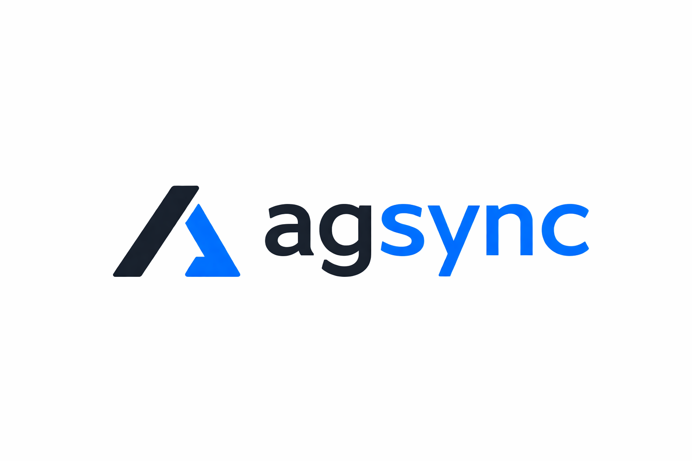

<p align="center">
  
</p>

<p align="center">
  Git-native CLI to sync skills, commands, and MCP servers across AI coding agents.
</p>

<p align="center">
  <a href="https://github.com/yiftahb/agsync/actions/workflows/ci.yml"></a>
  <a href="https://www.npmjs.com/package/agsync-cli"></a>
  <a href="https://www.npmjs.com/package/agsync-cli"></a>
  <a href="https://github.com/yiftahb/agsync/blob/main/LICENSE"></a>
</p>

## Supported Agents

| Agent | Instructions | Skills | Commands | MCP |
|-------|-------------|--------|----------|-----|
| Claude Code | `CLAUDE.md` | `.claude/skills/` | `.claude/commands/` | `.mcp.json` |
| Cursor | `AGENTS.md` | `.cursor/skills/` | `.cursor/commands/` | `.cursor/mcp.json` |
| Codex | `.codex/instructions.md` | `.codex/skills/` | `.codex/commands/` | `.codex/config.toml` |
| Windsurf | `AGENTS.md` | `.windsurf/skills/` | `.windsurf/commands/` | `.windsurf/mcp_config.json` |
| Copilot | `.github/copilot-instructions.md` | -- | `.github/agents/` | `.mcp.json` |
| Gemini | `GEMINI.md` | `.gemini/skills/` | `.gemini/commands/` | `.gemini/settings.json` |
| OpenCode | `AGENTS.md` | `.opencode/skills/` | `.opencode/command/` | `opencode.json` |
| Antigravity | `.agent/rules/instructions.md` | `.agent/skills/` | `.agent/commands/` | -- |

## Install

```bash
npm i -g agsync-cli
```

Or run directly:

```bash
npx agsync-cli
```

## Features

🤖 **Multi-Agent Sync** — Define skills, commands, and instructions once in `.agsync/`, generate native output for every agent your team uses. Symlinks keep everything in sync.

🧩 **Skill Extension** — Import skills from GitHub or ClawHub, extend them with local overrides, and resolve inheritance chains automatically. Supporting files (rules, scripts, references) are bundled alongside.

🔒 **Version Locking** — Pin external skills to exact versions. A lock file (`agsync-lock.yaml`) tracks resolved commits and content hashes for reproducible builds. Use `--frozen` in CI to enforce it.

🔌 **MCP Sync** — Define MCP servers in YAML, expand environment variables at sync time, and generate the correct config format (JSON or TOML) per agent with smart merging.

🏷️ **MCP Namespaces** — Tag MCP servers with namespaces (e.g. `ci-cd`, `coding-agents`) and filter at sync time with `agsync sync --namespace <name>` so each environment only gets the servers it needs.

📁 **Monorepo Scoping** — One `agsync.yaml` at the repo root, with `.agsync/` directories in any subfolder. Skills and commands are automatically prefixed (e.g. `frontend:my-skill`), built to the root, and each subfolder gets its own `AGENTS.md` with scoped instructions.

🔒 **Gitignore Management** — Automatically manage `.gitignore` entries for generated output. Choose between `on` (all output), `mcpOnly` (default, MCP configs only), or `off`.

📐 **Structured Context** — Enable `features.context: true` to write `.agsync/instructions.md` with structured `## HLD`, `## Guidelines`, and `## Patterns` sections. Guidelines support path scoping (`paths: ["backend/**"]`), named IDs, and package-level overrides. Each subfolder compiles its own self-contained `AGENTS.md` from the hierarchy.

🧾 **Code Review Output** — Enable `review: targets: [coderabbit]` to generate `.coderabbit.yaml` at the repo root on every `agsync sync`. Guidelines and their path scopes map directly to coderabbit `path_instructions` — one source of truth for agents and reviewers alike.

## Commands

| Command | Description |
|---------|-------------|
| `agsync init` | Scaffold a new project with `agsync.yaml` and `.agsync/` |
| `agsync skill add <name>` | Create a local empty skill |
| `agsync skill add github:<org/repo/path@ver>` | Import a skill from GitHub |
| `agsync skill add clawhub:<slug@ver>` | Import a skill from ClawHub |
| `agsync skill remove <name>` | Remove a skill |
| `agsync command add <name>` | Create a new command (.md) |
| `agsync command remove <name>` | Remove a command |
| `agsync mcp add <name>` | Create a new tool definition (.yaml) |
| `agsync mcp remove <name>` | Remove a tool |
| `agsync validate` | Validate config, skills, commands, and tool references |
| `agsync plan [--frozen] [--namespace <name>]` | Preview changes without writing files |
| `agsync sync [--frozen] [--namespace <name>]` | Generate output for all enabled agents |
| `agsync doctor` | Check environment health and enabled agents |
| `agsync version` | Show current version and check for updates |
| `agsync update` | Update to the latest version |
| `agsync help` | Show extended help |

## Monorepo Support

One `agsync.yaml` at the repo root, multiple `.agsync/` directories in subfolders:

```
project/
├── agsync.yaml              ← single config
├── .agsync/                 ← root skills, commands, mcp
├── frontend/
│   └── .agsync/             ← frontend-specific definitions
│       ├── instructions.md  → generates frontend/AGENTS.md
│       └── skills/ui-kit/
└── backend/
    └── .agsync/
        └── skills/api/
```

- Scoped skills are prefixed automatically (`frontend:ui-kit`) and output to `.agents/skills/frontend--ui-kit/` at the root
- Each subfolder with `.agsync/instructions.md` gets its own `AGENTS.md` generated in-place
- The root `AGENTS.md` cross-references scoped instructions: *"When working in folder: `frontend` — you MUST load `frontend/AGENTS.md`"*
- Agent symlinks (`CLAUDE.md`, `.claude/skills/`) are only created at the root
- `agsync skill add`, `command add`, `mcp add` resolve the nearest `.agsync/` upwards, so running from `frontend/` adds to `frontend/.agsync/`

## MCP Namespaces

Tag MCP servers with one or more namespaces and filter at sync time. Useful when CI runners and local coding agents need different sets of servers.

```yaml
# .agsync/mcp/github-actions.yaml
name: github-actions
description: GitHub Actions MCP server
namespaces: [ci-cd]
command: npx
args: ["-y", "@modelcontextprotocol/server-github-actions"]
```

```yaml
# .agsync/mcp/cursor-tools.yaml
name: cursor-tools
description: Tools for the local coding agent
namespaces: [coding-agents]
command: npx
args: ["-y", "@some/cursor-tools"]
```

Sync only the servers tagged for a namespace:

```bash
agsync sync --namespace ci-cd          # only ci-cd-tagged + untagged servers
agsync sync --namespace coding-agents  # only coding-agents-tagged + untagged servers
agsync sync                            # all servers (no filter)
```

Rules:

- `namespaces` is optional. MCPs without it (or with an empty array) are **always included** — treat them as global.
- A skill that references an MCP excluded by the active namespace produces a warning, not an error.
- Scaffold a tagged MCP with `agsync mcp add <name> --namespace ci-cd` (repeat the flag to add multiple).

## License

MIT
